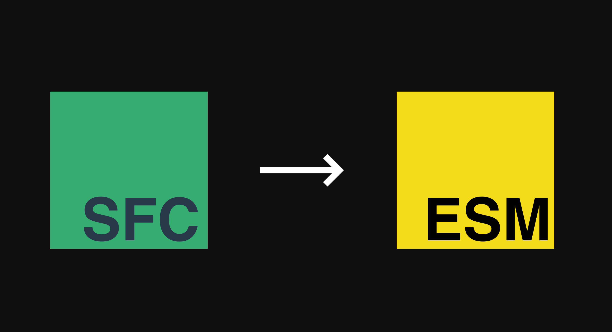

<h1 align="center">Vue SFC To ES Modules</h1>
<div align="center">

<p align="center">
  Transpiled <strong>Vue SFC File</strong> to <strong>ES modules</strong>.
</p>

<br>

[![NPM][npmBadge]][npmUrl]
[![NPM Download][npmDtBadge]][npmDtUrl]
[![License][licenseBadge]][licenseUrl]
<!-- [![Minzipped Size][bundlePhobiaBadge]][bundlePhobiaUrl] -->

[npmBadge]:https://img.shields.io/npm/v/vue-sfc2esm.svg?maxAge=2592000
[npmUrl]:https://www.npmjs.com/package/vue-sfc2esm@next

[npmDtBadge]:https://img.shields.io/npm/dt/vue-sfc2esm.svg
[npmDtUrl]:https://www.npmjs.com/package/vue-sfc2esm

[licenseBadge]:https://img.shields.io/badge/license-MIT-blue.svg
[licenseUrl]:https://raw.githubusercontent.com/vueblocks/vue-sfc2esm/master/LICENSE

<!-- [bundlePhobiaBadge]:https://badgen.net/bundlephobia/minzip/vue-sfc2esm
[bundlePhobiaUrl]:https://bundlephobia.com/result?p=vue-sfc2esm -->

</div>

## ✨ Features

* 💪 Fully Typed
* 🌳 TreeShakable & SideEffects Free, Check out [Bundle Phobia](https://bundlephobia.com/result?p=vue-sfc2esm)
* 📁 Virtual File System (Support Compile `.vue/.js` File).
* 👬 Friendly Error Tips

## 💡 Inspiration

This project is heavily inspired by [Vue SFC Playground](https://github.com/vuejs/vue-next/tree/master/packages/sfc-playground). Actually Copied from it.


## 📦 Installation

```bash
yarn add vue-sfc2esm -S
or
npm i vue-sfc2esm -S
```

## How it Works?

You could imagine that `vue-sfc2esm` has a virtual file system like vue project.

`vue-sfc2esm` will help you transpiled your sfc code base on `Vue 3` into es modules code blocks with [@vue/compiler-sfc](https://www.npmjs.com/package/@vue/compiler-sfc)

You could use these code blocks directly on the modern browser with `type="module"` in the `<script>` element.

### Example

```html
<script type="modules">
  // ES Modules Code Blocks Here.
</script>
```

## 📖 Usage

### addFile

> Add a file into the store, ready for compilation.

```js
import { addFile } from 'vue-sfc2esm'

addFile('HelloWorld.vue', `<template>
  <h1>{{ msg }}</h1>
</template>

<script setup>
const msg = 'Hello World!'
</script>
`)
```

### changeFile

> Change the file code, It will trigger `compileFile` action.

```js
import { changeFile } from 'vue-sfc2esm'

changeFile('HelloWorld.vue', `<template>
  <h1>{{ msg }}</h1>
</template>

<script setup>
const msg = 'Hello Vue SFC2ESM!'
</script>
`)
```

### deleteFile

> Delete the file in the store. with or without confirmation.

```js
import { deleteFile } from 'vue-sfc2esm'

deleteFile('HelloWorld.vue')
```

### CompileModules

> Transpiled Vue SFC File to ES modules with `@vue/compiler-sfc`.

```js
import { compileModules } from 'vue-sfc2esm'

(async function () {
  // Compile Default App.vue Component Or Files In Store.
  const modules = await compileModules('App.vue')
  console.log(`Successfully compiled [App.vue] to ES Modules.`)
  console.log(modules)
})()
```

## Typed

```typescript
/**
 * Transpiled Vue SFC File to ES modules with `@vue/compiler-sfc`.
 *
 * @param filename
 */
declare function compileModules(filename: string): Promise<Array<string>>;

/**
 * Record the code & errors when a sfc file has been compiled.
 */
interface FileCompiled {
    js: string;
    css: string;
    ssr: string;
    errors: Array<string | Error>;
}
/**
 * Simple Virtual File System
 */
declare class File {
    filename: string;
    code: string;
    compiled: FileCompiled;
    constructor(filename: string, code?: string);
}
/**
 * `vue-sfc2esm` built-in store.
 */
interface Store {
    files: Record<string, File>;
    activeFilename: string;
    readonly activeFile: File;
    readonly importMap: string | undefined;
    errors: Array<string | Error>;
}
declare const store: Store;
/**
 * Export the files code.
 *
 * @returns exported
 */
declare function exportFiles(): Record<string, string>;
/**
 * Record File errors when compiling file.
 *
 * @param errors
 */
declare function recordFileErrors(errors: Array<string | Error>): void;
/**
 * Add a file into the store, ready for compilation.
 *
 * @param filename
 * @param code
 */
declare function addFile(filename: string, code: string): void;
/**
 * Change the file code, It will trigger `compileFile` action.
 *
 * @param filename
 * @param code
 */
declare function changeFile(filename: string, code: string): void;
/**
 * Delete the file in the store. with or without confirmation.
 *
 * @param filename
 * @param withConfirm
 */
declare function deleteFile(filename: string, withConfirm?: boolean): void;

/**
 * Compile the `activeFile` in the store. It will change the File.compiled info.
 *
 * @param File
 */
declare function compileFile({ filename, code, compiled }: File): Promise<void>;
```

## 💻 Development
```
yarn install
```

### Compiles and hot-reloads for development
```
yarn dev
```

### Compiles and minifies for production
```
yarn build
```

## Who is using this?

* [vue-sfc-sandbox](https://github.com/xiaoluoboding/vue-sfc-sandbox)

## 📝 Change Log

[Check out CHANGELOG.md](./CHANGELOG.md)

## 📄 License

MIT [@xiaoluoboding](https://github.com/xiaoluoboding)
